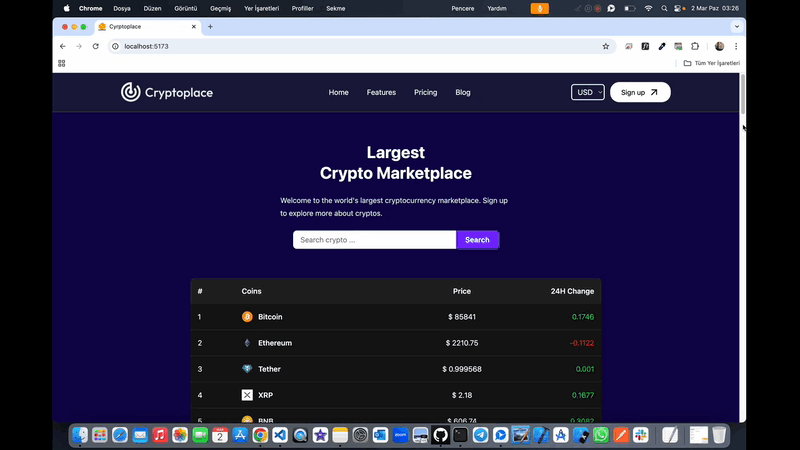

# Cryptoplace-Project 💰

<li>Bu proje online olarak Dijital para takip sisteminden oluşur.</li>
<li>Sistemde coin ismi,resmi,fiyatı,detayı ve anlık olarak değişen verilere grafik değerlerine ulaşabilirsiniz.</li>
<li>Her bir coin'in döviz cinsinden değeri mevcuttur.</li>
<li>Kullanıcı dostu responsive tasarımı vardır.</li>

# Kullanılan Teknolojiler 🎨

<li>⭐ React</li>
<li>⭐ Vite</li>
<li>⭐ Tailwind</li>
<li>⭐ React-Icons</li>
<li>⭐ Axios</li>
<li>⭐ API</li>
<li>⭐ Charts</li>
  
# Ekran Görüntüsü 🎥
      

# İletişim 📩
yunusemreoral@hotmail.com.tr

